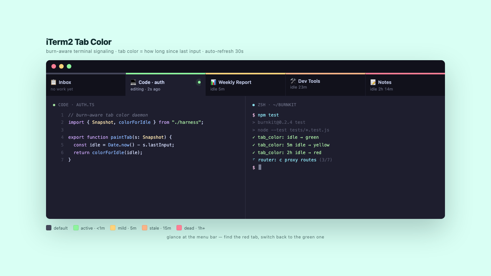
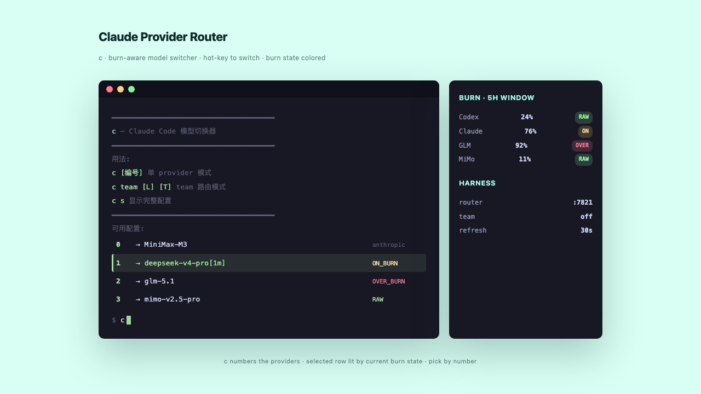
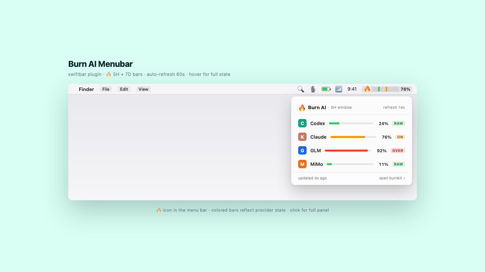

# BurnKit — Claude Provider Router + iTerm2 Tab Color + Burn AI

> Overclock the human. Then build the harness.

<p align="center">
  <table>
    <tr>
      <td></td>
      <td></td>
      <td></td>
    </tr>
    <tr>
      <td align="center"><b>iTerm2 Tab Color</b><br><sub>idle → red</sub></td>
      <td align="center"><b>c Router</b><br><sub>switch by number</sub></td>
      <td align="center"><b>🔥 Menu Bar</b><br><sub>state at a glance</sub></td>
    </tr>
  </table>
</p>

<p align="center">
  <em>glance at the menu bar — find the red tab, switch back to the green one</em>
</p>

[](https://www.npmjs.com/package/burnkit)
[](LICENSE)
[](#install)
[](#what-you-get)
[](#what-you-get)

[中文说明](README.zh-CN.md)

BurnKit routes AI work to the right provider, colors idle tabs when AI waits, and tracks plan burn before expensive windows evaporate. Three tools for developers running Claude Code and Codex in parallel.

Chinese spirit name: `卷王三件套`.

This is not about going productivity-crazy, and it is not about making you go crazy either.

BurnKit exposes the awkward truth inside AI coding: models keep getting faster, but the workflow still jams around the human operator. You think you need a stronger model. Then you notice the real drag: provider choice, idle sessions, context switching, wasted plan windows, and the person who keeps answering "should I continue?"

BurnKit turns those hidden costs into signals. When the signals become too many to handle manually, the next question becomes obvious: how do you make AI ask less, queue work, split tasks, verify results, and ship without constant babysitting?

That is the harness entrance.

## What You Get

### Claude Provider Router — `c` command

Switch between Claude / Codex providers without editing config. Split Agent Team traffic across providers.

```
c 0              # Use provider 0 (e.g., Claude)
c team 2 0       # Team mode: leader on provider 2, teammate on 0
```


### iTerm2 Tab Color — Idle tab signaling

Green/Yellow/Red tabs when AI waits. Only inactive tabs get colored—notifications point at what you're missing.

```
burnkit install tabs
```

| Color | Meaning |
|-------|---------|
| Green | AI just finished, collect now |
| Yellow | Waited a while, parallelism leaking |
| Red | Waited too long, human late |
| White | Active, processing, or clean |


### Burn AI — Plan burn tracking

Menu bar shows 5h/7d usage across all providers with colored progress bars. No login, reads local Claude Code / Codex data.

```
burnkit status --refresh
```


> **Tip:** Menu bar crowded? Use [Dozer](https://github.com/Mortennn/Dozer) to hide icons and keep Burn AI front.

> **Tip:** If your menu bar gets crowded, consider a free tool like [Dozer](https://github.com/Mortennn/Dozer) to hide less-used icons and keep the Burn AI menubar signal front and center.

## Install

```bash
npm install -g burnkit
burnkit install all
```

Or run without installing:

```bash
npx burnkit install all
```


Edit provider config (add tokens):

```bash
# Claude / Codex routing
$EDITOR ~/.burnkit-router/config.env

# DeepSeek / GLM / MiniMax usage tracking
$EDITOR ~/.burn-ai/config.json
```

Example `~/.burn-ai/config.json`:

```json
{
  "providers": ["codex", "claude", "deepseek", "glm", "minimax"],
  "deepseek": {
    "apiKey": "your-deepseek-api-key"
  },
  "glm": {
    "baseUrl": "https://open.bigmodel.cn",
    "apiKey": "your-zhipu-api-key"
  },
  "minimax": {
    "region": "cn",
    "apiKey": "your-minimax-api-key"
  }
}
```

Run Claude Code through provider:

```bash
c 0
c team 2 0
```

Check plan burn:

```bash
burnkit status --refresh
```

Uninstall:

```bash
burnkit uninstall all
```

## Let Your Agent Install It

```text
Install BurnKit for me. Use `burnkit install all --dry-run` first, show me what changes, wait for confirmation, then run real install. Preserve ~/.burnkit-router/config.env if it exists.
```

## The Loop It Creates

Start more AI sessions → Watch tabs turn green/yellow/red → See Burn AI wasting 5h/7d windows → Hit human scheduling limit → Build a real agent harness.

BurnKit is a pressure rig. It exposes hidden costs so the questions become architectural instead of motivational.

## Commands

| Command | Purpose |
|---------|---------|
| `burnkit doctor` | Check prerequisites and tool readiness |
| `burnkit install all` | Install router, tabs, burn-ai |
| `burnkit uninstall all` | Remove all tools |
| `c 0` / `c 1` / `c 2` | Start Claude Code on provider N |
| `c team 2 0` | Team mode: leader on 2, teammate on 0 |
| `burnkit status --refresh` | Check plan burn |

## Repository Layout

```
bin/burnkit                          # CLI entry point
tools/claude-provider-router/        # c command, config.env
tools/iterm2-tab-color/              # Python daemon + shell hooks
tools/burn-ai/                       # Node.js CLI + SwiftBar plugin
```

## Tool Docs

- [Claude Provider Router](tools/claude-provider-router/README.md)
- [iTerm2 Tab Color](tools/iterm2-tab-color/README.md) · [中文](tools/iterm2-tab-color/README.zh-CN.md)
- [Burn AI](tools/burn-ai/README.md)

## Safety Notes

- `tools/claude-provider-router/config.env` contains tokens and must not be committed.
- Burn AI does not manage login state, credentials, or private usage APIs. It reads local usage data already produced by Claude Code and Codex.
- Burn AI does not overwrite existing Claude Code status line scripts. If one exists, it asks before installing a wrapper; skipping prints manual integration steps and explains which Claude features stay unavailable.
- Tab color behavior, state cleanup, process detection, hook events, and daemon scheduling are behavior changes. Do not bundle them with docs or release polish.

## Development Checks

For the release entry point:

```bash
bash -n bin/burnkit
bin/burnkit --help
bin/burnkit doctor
scripts/e2e-install-verify.sh --dry-run
```

For real install verification on a local machine:

```bash
scripts/e2e-install-verify.sh --real
```

The e2e verifier checks both router install paths: missing `config.env` is created from the template with mode `600`, and an existing `tools/claude-provider-router/config.env` is preserved byte-for-byte with its original permissions.

For iTerm2 Tab Color changes:

```bash
bash -n tools/iterm2-tab-color/install-core.sh tools/iterm2-tab-color/uninstall-core.sh tools/iterm2-tab-color/install.sh tools/iterm2-tab-color/uninstall.sh tools/iterm2-tab-color/tab_color_hook.sh
python3 -m py_compile tools/iterm2-tab-color/tab_color_daemon.py tools/iterm2-tab-color/reset_tab.py tools/iterm2-tab-color/test_daemon.py
python3 -m unittest tools/iterm2-tab-color/test_daemon.py
```

For Burn AI changes:

```bash
cd tools/burn-ai
npm ci
npm test
npm run build
npx --no-install burn-ai install
burn-ai install
npx --no-install burn-ai doctor --dry-run
npx --no-install burn-ai status --fixtures
npx --no-install burn-ai menubar render
git diff --check
```

When installing Burn AI from this repository, prefer `bin/burnkit install burn` or `bin/burnkit install all`; those paths rebuild `tools/burn-ai` before copying the runtime into `~/.burn-ai/app`.

## Contributors

<!-- ALL-CONTRIBUTORS-LIST:START - Do not remove or modify this section -->
<!-- prettier-ignore-start -->
<!-- markdownlint-disable -->
<table>
  <tbody>
    <tr>
      <td align="center" valign="top" width="14.28%">
        <a href="https://github.com/huajuan404">
          
        </a>
        <br />
        <a href="https://github.com/huajuan404">huajuan404</a>
        <br />
        <a href="#" title="Code">💻</a>
        <a href="#" title="Documentation">📖</a>
        <a href="#" title="Design">🎨</a>
      </td>
    </tr>
  </tbody>
</table>
<!-- markdownlint-restore -->
<!-- prettier-ignore-end -->
<!-- ALL-CONTRIBUTORS-LIST:END -->

## License

[MIT](LICENSE)
